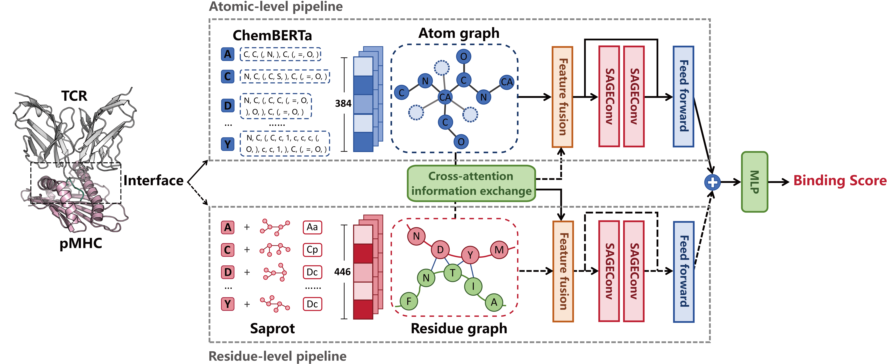

# SAGERank
`SageTCR: a structure-based model integrating residue- and atom-level representations for enhanced TCR-pMHC binding prediction`

## `The framework of SageTCR:`

## Dependencies
CUDA 12.1  
python==3.12  
torch==2.2  
torch_geometric==2.5.3
`conda install -c conda-forge -c bioconda hhsuite`  
`conda install conda-forge::pymol-open-source`  
`pip install transformers==4.37.0 biopandas scikit-learn biopython==1.79 numpy==1.26`  
Install SaProt and ChemBERTa  

## Data preparation
1. `python data_processing/extract_interface.py` Running this file will extract the interface from the PDBfile of a full TCR-pMHC complex structure. It is necessary to rename the protein chains so that the pMHC portion is labeled as chain C and the TCR portion as chain D.
2. `python data_processing/language_model_encoder_complex.py` Extract residue-level SaProt embeddings and atom-level ChemBERTa embeddings for the interface.
3. `python data_processing/generate_dataset.py` Generate the dataset for SageTCR.
   
## Training on your own data set
Follow the steps in data preparation, if you have access to a large number of graph structure files, then you can use the `train.py` script for training, and you can also use `eval.py` for testing related tasks

